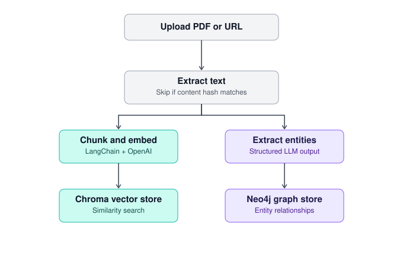
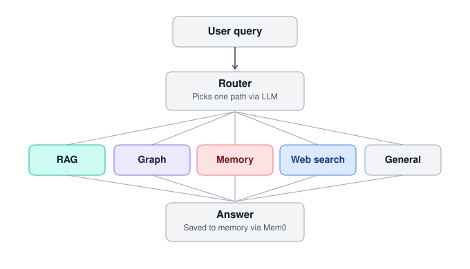
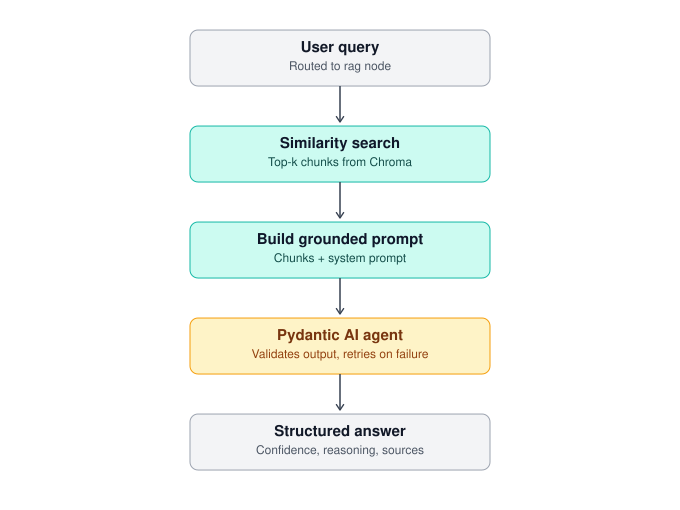
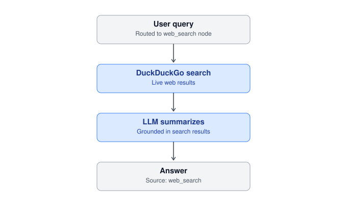
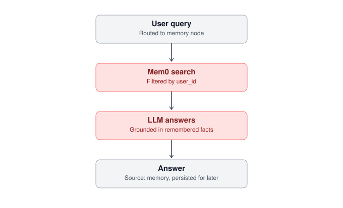
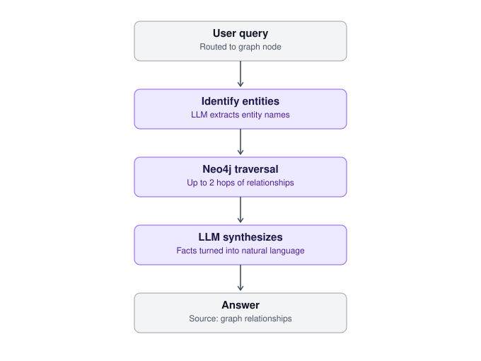

# GenAI knowledge assistant

A FastAPI backend that turns your own PDFs and web pages into a knowledge
base you can ask questions of — through retrieval, a knowledge graph,
persistent memory, and live web search, with an LLM router deciding which
approach fits each question.

Built as a practice project while working through a Generative & Agentic
AI course. I made heavy use of an LLM (Claude) throughout development —
for scaffolding, debugging dependency/API mismatches, and working through
architectural decisions — while directing the design, structure, and every
tool/library choice myself.

## What it does

1. **Ingest** — drop in a PDF or a URL. Text is extracted, deduplicated by
   content hash, chunked, and embedded into a vector store. In parallel,
   named entities and their relationships are extracted into a knowledge
   graph.
2. **Ask** — send a question to the agent. A router node decides the best
   way to answer it: your documents, the knowledge graph, something you
   told it before, a live web search, or general knowledge.
3. **Remember** — every exchange is distilled into persistent memory, so
   the assistant recalls relevant facts about you across sessions.

## Architecture

### Ingestion pipeline



### Agent routing



Each route has its own shape:

- **RAG** — similarity search over Chroma, grounded prompt, answered by a
  Pydantic AI agent that validates its own structured output (answer,
  confidence, reasoning) and retries automatically if validation fails.
- **Graph** — identifies entities in the question, traverses up to two
  hops of relationships in Neo4j, and synthesizes the result.
- **Memory** — searches Mem0 for relevant facts remembered from past
  conversations and answers grounded in those.
- **Web search** — runs a live DuckDuckGo search for time-sensitive
  questions and summarizes the results.
- **General** — falls back to the LLM's own knowledge when nothing else
  applies.

<details>
<summary>Per-path detail diagrams</summary>

**RAG**


**Web search**


**Memory**


**Graph**


</details>

## Tech stack

| Layer              | Tools                |
| ------------------ | -------------------- |
| API                | FastAPI, Uvicorn     |
| Orchestration      | LangChain, LangGraph |
| Structured output  | Pydantic AI          |
| Vector store       | ChromaDB             |
| Knowledge graph    | Neo4j (AuraDB)       |
| Memory             | Mem0                 |
| LLM / embeddings   | OpenAI               |
| Package management | uv                   |

## Project structure

```
genai-knowledge-assistant/
├── pyproject.toml
├── src/
│   └── genai_knowledge_assistant/
│       ├── main.py              # FastAPI entrypoint
│       ├── config.py            # settings
│       ├── api/                 # routers
│       ├── services/             # business logic
│       ├── repositories/         # Chroma, Neo4j, document storage
│       ├── agents/                # LangGraph nodes and graph definition
│       ├── llm/                   # embeddings, structured agent
│       ├── models/                 # Pydantic schemas
│       └── core/                    # extraction, chunking
├── tests/
└── data/                              # uploads, chroma_db (gitignored)
```

## Setup

```bash
uv sync
cp .env.example .env   # add your OpenAI key and Neo4j Aura credentials
uv run uvicorn genai_knowledge_assistant.main:app --reload
```

Then open `http://localhost:8000/docs` to try it via Swagger UI.

## Endpoints

| Endpoint                     | Purpose                               |
| ---------------------------- | ------------------------------------- |
| `POST /documents/upload`     | Ingest a PDF                          |
| `POST /documents/url`        | Ingest a web page                     |
| `GET /documents`             | List ingested documents               |
| `POST /chat/agent`           | Ask a question — routed automatically |
| `GET /memory`                | View what's been remembered           |
| `DELETE /memory`             | Clear memory                          |
| `GET /graph/entities`        | List extracted entities               |
| `GET /graph/related?entity=` | View relationships for an entity      |
| `GET /health`                | Check Neo4j and Chroma connectivity   |

## Notes

- Re-ingesting an unchanged file is a no-op (content-hash dedup); a
  changed file under the same name replaces its old chunks and graph
  relationships automatically.
- This is a single-user setup (no auth) by design — it's a learning
  project, not a production deployment.
